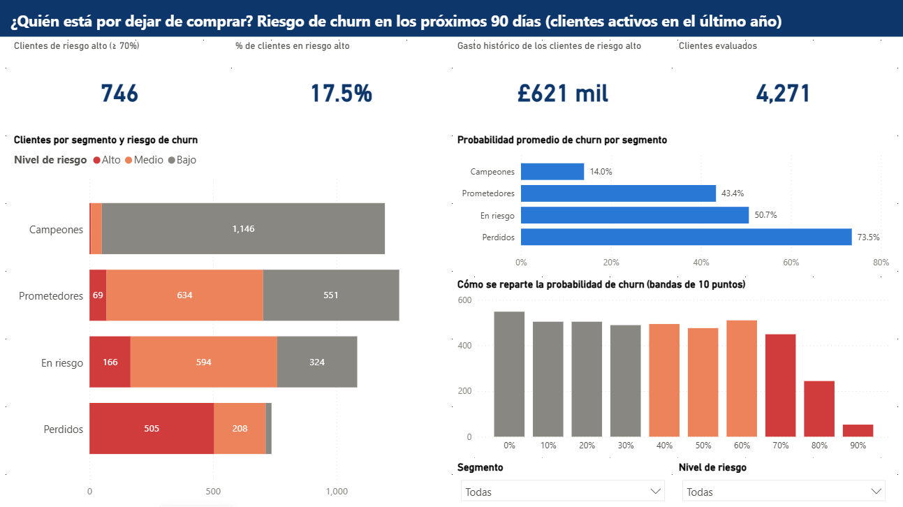

# Abandono (churn) y segmentación de clientes (Online Retail II)

[English version](README.md)

En este proyecto uso dos años de ventas de una tienda en línea de regalos
(alrededor de 1 millón de líneas de factura y 5,852 clientes). La mayoría de sus
clientes son mayoristas. No cancelan una suscripción, simplemente dejan de
pedir, así que la tienda no sabe bien a quién está perdiendo.

Quería responder dos preguntas:

1. ¿Qué tipos de clientes tiene la tienda?
2. ¿Qué clientes activos probablemente van a dejar de comprar, y por qué?

## Hallazgos principales

- El 21% de los clientes (el grupo *Champions*) genera el 74% de los ingresos.
  Piden cada pocas semanas (19 pedidos en promedio) y gastan unas £10,500 cada uno.
- 1,444 clientes están en el grupo *At risk* (en riesgo). Antes pedían con
  regularidad (5 pedidos, unas £2,000 cada uno), pero en promedio llevan unos 7
  meses sin comprar.
- Las señales más fuertes de abandono son qué tan reciente y qué tan seguido
  compra un cliente. Por ejemplo, un cliente que compró un solo producto, una
  sola vez, hace once meses, tiene 97% de probabilidad de no volver.
- El modelo tiene un ROC-AUC de 0.76 en clientes que no vio durante el
  entrenamiento. Esto quiere decir que si tomo un cliente que se fue y uno que
  se quedó, el modelo le da un puntaje más alto al que se fue el 76% de las
  veces. Solo usa el historial de compras.

| Segmento | Clientes | Días prom. desde última compra | Pedidos prom. | Gasto prom. | % de ingresos |
|----------|---------:|------:|------:|---------:|------:|
| Champions | 1,201 | 28 | 19.0 | £10,470 | 73.7% |
| At risk | 1,444 | 230 | 5.0 | £1,966 | 16.6% |
| Promising | 1,254 | 29 | 3.0 | £829 | 6.1% |
| Lost | 1,953 | 396 | 1.4 | £316 | 3.6% |


## Recomendación

4,271 clientes compraron algo en el último año. El modelo les da a 746 de ellos
un riesgo alto de irse en los próximos 90 días (probabilidad de 0.7 o más).
Creo que la tienda no debería tratarlos a todos igual:

- Enfocarse primero en el grupo *At risk*: 760 de ellos tienen riesgo medio o
  alto. Ya demostraron que compran con regularidad, así que recuperarlos es lo
  que más vale la pena.
- Contactar en persona a los 50 *Champions* con riesgo medio o alto, porque
  cada uno vale unas £10,000.
- No gastar dinero de retención en los clientes *Lost* con riesgo alto.
  Compraron muy poco y probablemente ya se fueron.

## Qué provoca el abandono


Usé SHAP para ver qué variables suben o bajan la predicción. Cada punto es un
cliente. Los puntos a la derecha empujan hacia el abandono, y el rojo significa
que esa variable tiene un valor alto para ese cliente. Mucho tiempo sin comprar
empuja hacia el abandono. Muchos pedidos, gasto alto, actividad reciente y
comprar muchos productos distintos hacen que el cliente tenga más probabilidad
de quedarse.

## Dashboard

Hice un reporte de Power BI con cuatro páginas: los segmentos de clientes, el
riesgo de abandono, una lista de acción con los clientes de riesgo alto
ordenados por cuánto gastan, y una página que muestra qué tan bueno es el modelo.



Otras páginas: [Segmentos](reports/figures/powerbi_es_segments.png),
[Lista de acción](reports/figures/powerbi_es_action_list.png),
[Modelo](reports/figures/powerbi_es_model.png)

Estas capturas son de la versión en español (`powerbi/ChurnDashboardES.pbip`).
El mismo dashboard existe en inglés (`powerbi/ChurnDashboard.pbip`, ver
[README.md](README.md)).

---

## Detalles técnicos

### Pasos

1. Descargar el Excel de UCI y guardarlo como CSV.
2. Cargar el CSV en PostgreSQL (en Docker) y limpiarlo con una vista SQL.
3. Agrupar a los clientes con RFM + KMeans y guardarlos en `customer_segments`.
4. Crear las variables y la etiqueta de churn, y entrenar regresión logística y
   XGBoost (las corridas se registran en MLflow).
5. Usar el mejor modelo para las gráficas SHAP, un endpoint `/predict` con
   FastAPI y para calificar a los clientes actuales en `customer_scores`.
6. Power BI lee `customer_segments` y `customer_scores` desde Postgres.

| Paso | Archivo | Qué hace |
|------|---------|----------|
| 1 | `docker-compose.yml` | PostgreSQL 16 (puerto 5433 del host) y la API |
| 2 | `src/download_data.py` | Descarga el dataset, une las dos hojas y quita 34,335 filas duplicadas |
| 3 | `src/load_to_postgres.py`, `sql/` | Carga 1,033,036 filas; una vista deja 776,583 compras válidas |
| 4 | `notebooks/eda.ipynb`, `sql/03_eda_queries.sql` | Análisis exploratorio |
| 5 | `src/segment_customers.py` | RFM, luego logaritmo + escalado, luego KMeans (k=4) |
| 6 | `src/build_features.py` | 9 variables de comportamiento y la etiqueta de churn |
| 7 | `src/train_model.py` | Regresión logística vs XGBoost con validación cruzada de 5 partes, registrado en MLflow |
| 8 | `src/explain_model.py` | Gráficas SHAP para todo el modelo y para un cliente |
| 9 | `src/score_customers.py` | Califica a los clientes actuales y los guarda en Postgres para Power BI |
| 10 | `api/` | Servicio FastAPI con el modelo entrenado |
| 11 | `powerbi/ChurnDashboard.pbip` | Dashboard de Power BI (4 páginas) que lee de Postgres |
| 12 | `powerbi/make_spanish_report.py` | Crea la copia en español del reporte (`ChurnDashboardES.pbip`) |

### Cómo definí el churn

No hay suscripción, así que usé una fecha de corte (11-sep-2011). Un cliente
hizo churn si no compró nada en los 90 días después del corte. Las variables
solo usan datos de antes del corte, así el modelo no puede ver el futuro (hay
una prueba para esto en `tests/test_features.py`).

Solo dejé a los clientes que compraron algo en el año antes del corte. Si
incluía a gente que lleva dos años sin comprar, serían muy fáciles de predecir
y las métricas se verían mejor de lo que son en realidad. Al final tuve 4,306
clientes y el 49% hizo churn.

### Resultados del modelo (conjunto de prueba, 862 clientes)

| Modelo | ROC-AUC CV | ROC-AUC prueba | PR-AUC prueba | Precision | Recall | F1 |
|--------|-----------:|---------------:|--------------:|----------:|-------:|---:|
| Regresión logística (log + escalado) | 0.762 | 0.754 | 0.717 | 0.670 | 0.722 | 0.695 |
| XGBoost (elegido) | 0.770 | 0.758 | 0.712 | 0.679 | 0.715 | 0.697 |

Elegí el modelo con validación cruzada, no con el conjunto de prueba. Ganó
XGBoost, pero por menos de 0.01 de AUC. La regresión logística es casi igual de
buena, y eso me dice que casi toda la información está en la recencia y la
frecuencia.

### Decisiones que tomé

- Puse todas las reglas de limpieza en una vista SQL (`sql/02_clean_view.sql`),
  así puedo cambiar una regla sin volver a cargar los datos.
- Apliqué logaritmo y escalado antes de KMeans. Sin el logaritmo, KMeans ponía a
  42 clientes extremos en dos grupos diminutos y a 3,830 clientes en un solo
  grupo grande.
- Usé k=4. k=2 tenía mejor silhouette, pero dos grupos no son muy útiles para el
  negocio, y k=4 es un máximo local ([gráfica](reports/figures/choose_k.png)).
- El entrenamiento y la calificación usan la misma función `build_features`, así
  las variables se calculan igual en los dos lados.
- La API usa las mismas versiones de scikit-learn y XGBoost que el
  entrenamiento, porque el modelo está guardado como pickle y puede no cargar
  con otras versiones.
- Guardé el dashboard de Power BI como proyecto PBIP. Las medidas (TMDL) y los
  visuales (PBIR) son archivos de texto, así que puedo ver los cambios en git
  como con el código.
- El reporte en español se genera a partir del de inglés. Los dos usan el mismo
  modelo semántico, las etiquetas en español son columnas extra hechas en Power
  Query, y un script copia el reporte en inglés y lo traduce. Así solo edito un
  reporte.

### Limitaciones

- Los 90 días después del corte (sep a dic 2011) son la temporada navideña, así
  que el churn probablemente es menor que en un periodo normal. Con más años de
  datos usaría varias fechas de corte.
- Solo tengo el historial de compras. No hay datos de visitas al sitio, tickets
  de soporte ni satisfacción del cliente, y eso limita qué tan bueno puede ser
  el modelo.
- El umbral de 0.5 y los niveles de riesgo 0.4/0.7 no están basados en costos
  reales de campaña.

### Cómo correrlo

Necesitas Docker Desktop y Python 3.14.

```bash
python -m venv .venv
.venv\Scripts\activate            # Windows  (source .venv/bin/activate en Linux/Mac)
pip install -r requirements.txt
cp .env.example .env

docker compose up -d db
python src/download_data.py
python src/load_to_postgres.py
python src/segment_customers.py
python src/build_features.py
python src/train_model.py
python src/explain_model.py
python src/score_customers.py
pytest

docker compose up -d --build api   # http://localhost:8000/docs
mlflow ui --backend-store-uri sqlite:///mlflow.db   # http://localhost:5000
```

Dashboard: abre `powerbi/ChurnDashboard.pbip` en Power BI Desktop y presiona
*Actualizar* (el usuario y la contraseña de Postgres son `retail` / `retail`,
del `.env`). La versión en español es `powerbi/ChurnDashboardES.pbip`. Si
cambias el reporte en inglés, corre `python powerbi/make_spanish_report.py` con
Desktop cerrado para actualizar el de español.

Ejemplo de petición:

```bash
curl -X POST http://localhost:8000/predict -H "Content-Type: application/json" \
  -d '{"recency_days": 300, "frequency": 1, "monetary": 80, "avg_order_value": 80,
       "tenure_days": 300, "distinct_products": 2, "orders_last_90d": 0,
       "cancel_rate": 0, "is_uk": 1}'
# {"churn_probability": 0.944, "will_churn": true}
```

### Datos

[Online Retail II](https://archive.ics.uci.edu/dataset/502/online+retail+ii),
del UCI Machine Learning Repository, donado por Daqing Chen. Licencia: CC BY 4.0.
