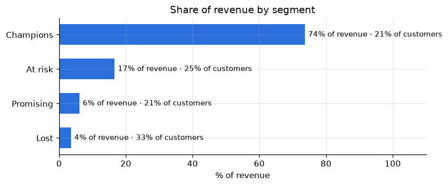
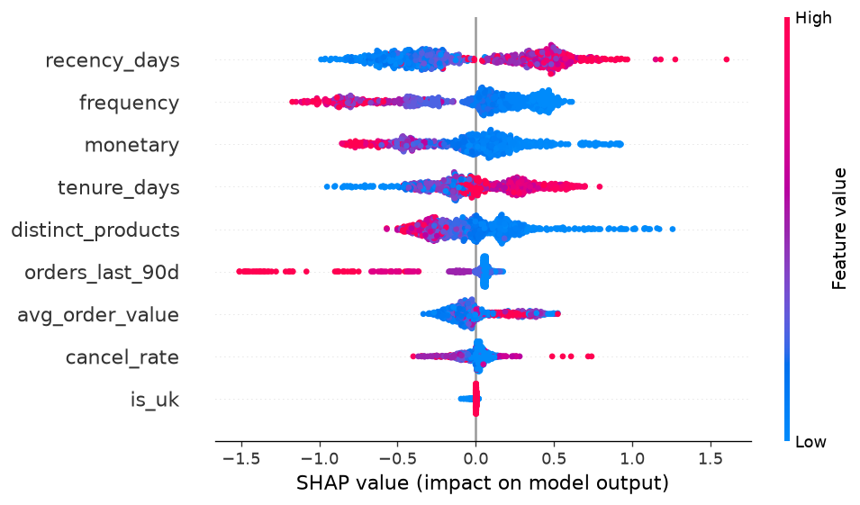
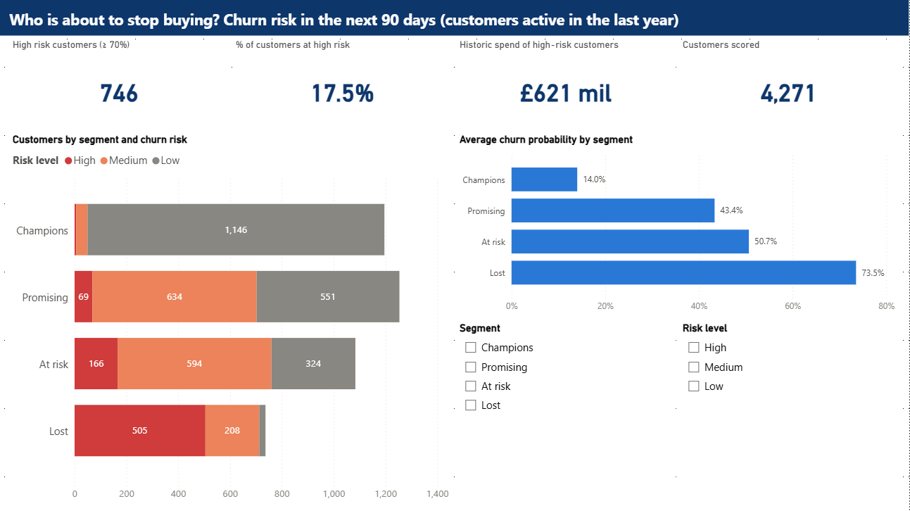

# Customer Churn Prediction & Segmentation — Online Retail II

[Versión en español](README.es.md)

An online gift shop sells mostly to wholesalers. Customers never "cancel": they
just stop ordering. This project answers two questions with two years of real
sales (1 million invoice lines, 5,852 customers):

1. **Who are our customers?** Four groups with a clear business meaning.
2. **Who is about to stop buying?** A churn probability for every active
   customer, with the reasons behind it.

## Key findings

- **21% of customers bring 74% of the revenue.** These *Champions* order every few
  weeks (19 orders on average) and spend ~£10,500 each.
- **1,444 customers are *At risk*:** they used to order regularly (5 orders,
  ~£2,000 each) but have been silent for ~7 months on average.
- **How recently and how often a customer buys** are by far the strongest signals
  of leaving. Someone who bought one product, once, eleven months ago, has a 97%
  chance of not coming back.
- The model ranks a random leaver above a random stayer **76% of the time**
  (ROC-AUC 0.76 on customers it never saw), using purchase history alone.

| Segment | Customers | Avg. days since last order | Avg. orders | Avg. spend | Share of revenue |
|---------|---------:|------:|------:|---------:|------:|
| Champions | 1,201 | 28 | 19.0 | £10,470 | 73.7% |
| At risk | 1,444 | 230 | 5.0 | £1,966 | 16.6% |
| Promising | 1,254 | 29 | 3.0 | £829 | 6.1% |
| Lost | 1,953 | 396 | 1.4 | £316 | 3.6% |



## Recommendation

Of the 4,271 customers who bought in the last year, 746 are at high risk of
leaving in the next 90 days. Not all of them are worth the same:

- **Prioritise the 760 *At risk* customers with medium or high churn risk.** They
  have proven they buy regularly; winning them back pays off the most.
- **Give the 50 *Champions* showing medium/high risk personal attention.** Each
  is worth ~£10,000.
- **Do not spend retention budget on high-risk *Lost* customers.** They bought
  little and are most likely already gone.

## What drives churn



Each dot is a customer. Dots to the right push towards churn; red means a high
value of that feature. Long time since the last order pushes towards churn;
many orders, high spend, recent activity and a varied basket keep customers.

## Dashboard

A four-page Power BI report puts this in front of the business: who the
customers are, who is at risk, an action list of high-risk customers sorted by
how much they are worth, and how good the model is.



More pages: [Segments](reports/figures/powerbi_segments.png) ·
[Action list](reports/figures/powerbi_action_list.png) ·
[Model](reports/figures/powerbi_model.png)

The same dashboard also exists in Spanish (`powerbi/ChurnDashboardES.pbip`, see
[README.es.md](README.es.md)).

---

## Technical details

### Pipeline

```
UCI Excel ─► CSV ─► PostgreSQL (Docker) ─► SQL cleaning view
                                         ├─► RFM + KMeans ─► customer_segments
                                         └─► features + churn label ─► LogReg vs XGBoost (MLflow)
                                                                        ├─► SHAP plots
                                                                        ├─► FastAPI /predict (Docker)
                                                                        └─► customer_scores ─► Power BI
```

| Step | File | What it does |
|------|------|--------------|
| 1 | `docker-compose.yml` | PostgreSQL 16 (host port 5433) and the API |
| 2 | `src/download_data.py` | Downloads the dataset, merges both sheets, removes 34,335 duplicated rows |
| 3 | `src/load_to_postgres.py`, `sql/` | Loads 1,033,036 rows; a view keeps 776,583 valid purchases |
| 4 | `notebooks/eda.ipynb`, `sql/03_eda_queries.sql` | Exploratory analysis |
| 5 | `src/segment_customers.py` | RFM → log + standard scaling → KMeans (k=4) |
| 6 | `src/build_features.py` | 9 behavioural features and the churn label |
| 7 | `src/train_model.py` | Logistic regression vs XGBoost, 5-fold CV, tracked in MLflow |
| 8 | `src/explain_model.py` | SHAP global and per-customer explanations |
| 9 | `src/score_customers.py` | Scores current customers into Postgres for Power BI |
| 10 | `api/` | FastAPI service with the trained model |
| 11 | `powerbi/ChurnDashboard.pbip` | Power BI dashboard (4 pages) reading from Postgres |
| 12 | `powerbi/make_spanish_report.py` | Builds the Spanish copy of the report (`ChurnDashboardES.pbip`) |

### Churn definition

There is no subscription, so churn is defined with a cutoff date: **a customer
churned if they made no purchase in the 90 days after the cutoff** (11 Sep 2011).
Features use only data before the cutoff, which prevents data leakage (tested in
`tests/test_features.py`). Only customers who bought in the year before the
cutoff are included: predicting someone inactive for two years is trivial and
inflates the metrics. Result: 4,306 customers, 49% churn.

### Model results (test set, 862 customers)

| Model | CV ROC-AUC | Test ROC-AUC | Test PR-AUC | Precision | Recall | F1 |
|-------|-----------:|-------------:|------------:|----------:|-------:|---:|
| Logistic regression (log + scaler) | 0.762 | 0.754 | 0.717 | 0.670 | 0.722 | 0.695 |
| **XGBoost** | **0.770** | **0.758** | 0.712 | 0.679 | 0.715 | 0.697 |

The model is selected by cross-validation, not by the test set. XGBoost wins by
less than 0.01 AUC; the simple baseline is almost as good, which is worth
knowing: most of the signal is in recency and frequency.

### Key decisions

- **SQL view for cleaning** — rules live in one file (`sql/02_clean_view.sql`) and
  can change without reloading data.
- **log + scaling before KMeans** — without the log, KMeans isolates 42 extreme
  customers in two tiny clusters and puts 3,830 in one.
- **k = 4** — k=2 has the best silhouette but is not actionable; k=4 is a local
  maximum ([chart](reports/figures/choose_k.png)).
- **Same `build_features` function for training and scoring** — avoids
  training/serving skew.
- **API pins the training library versions** — the model is a pickle; it must be
  loaded with the same scikit-learn/XGBoost versions.
- **Power BI as a PBIP project** — the report and its model (TMDL measures, PBIR
  visuals) are plain text files, so the dashboard is versioned and reviewed in git
  like the code.
- **Spanish report generated from the English one** — both reports share one
  semantic model; Spanish labels are extra columns built in Power Query, and a
  script copies the English report and translates it, so the two never drift.

### Limitations

- The 90-day label window (Sep–Dec 2011) is the Christmas peak, so measured churn
  is likely lower than in a quiet season. With more years of data I would use
  several cutoffs.
- Only purchase history is available: no website visits, support tickets or
  satisfaction data, which caps the achievable accuracy.
- The 0.5 decision threshold and the 0.4/0.7 risk levels are not tuned to real
  campaign costs.

### How to run

Requirements: Docker Desktop and Python 3.14.

```bash
python -m venv .venv
.venv\Scripts\activate            # Windows  (source .venv/bin/activate on Linux/Mac)
pip install -r requirements.txt
cp .env.example .env

docker compose up -d db
python src/download_data.py
python src/load_to_postgres.py
python src/segment_customers.py
python src/build_features.py
python src/train_model.py
python src/explain_model.py
python src/score_customers.py
pytest

docker compose up -d --build api   # http://localhost:8000/docs
mlflow ui --backend-store-uri sqlite:///mlflow.db   # http://localhost:5000
```

Dashboard: open `powerbi/ChurnDashboard.pbip` in Power BI Desktop and click
*Refresh* (Postgres user and password: `retail` / `retail`, from `.env`).
Spanish version: `powerbi/ChurnDashboardES.pbip`. After changing the English
report, rebuild it with `python powerbi/make_spanish_report.py` (Desktop closed).

Example request:

```bash
curl -X POST http://localhost:8000/predict -H "Content-Type: application/json" \
  -d '{"recency_days": 300, "frequency": 1, "monetary": 80, "avg_order_value": 80,
       "tenure_days": 300, "distinct_products": 2, "orders_last_90d": 0,
       "cancel_rate": 0, "is_uk": 1}'
# {"churn_probability": 0.944, "will_churn": true}
```

### Data

[Online Retail II](https://archive.ics.uci.edu/dataset/502/online+retail+ii),
UCI Machine Learning Repository, donated by Daqing Chen. License: CC BY 4.0.
